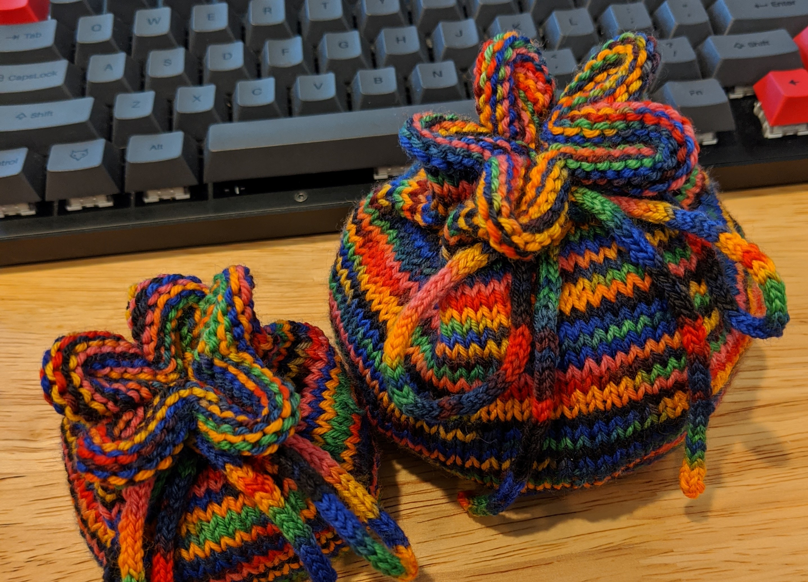

# Dice Bag Variations

Based on [this pattern on Ravelry](https://www.ravelry.com/patterns/library/knitting-gms-dice-pouch).

## Sizing recommendations

Here are some recommendations for dice bags. Small bags (S) are intended for 1-3 polyhedral sets. Large bags (L) are intended for 6-10. Stitches are listed with both multiple of 8 recommendations as per the pattern and multiple of 10 recommendations for my [preferred drawstring style](#flower-style-closure).

These are all approximates - you can make a lot of changes to this pattern.

| Yarn weight | Needle size (US) | Stitches (S) | Stitches (L) | I-cord needle size (US) |
| --- | --- | --- | --- | --- |
| Fingering/sock | 3 | 60 / 64 | 80 / 80 | 1 |
| DK-Worsted | 5-7 | 40 / 40 | 60 / 64 | 3-5 |

## Flower-style closure

The pattern uses multiples of 8 stitches to make a bag with 8 drawstring holes, which creates a closed bag that looks like this:

I've found that using multiples of 10 stitches and creating 10 drawstring holes creates a prettier closure:

It's a little trickier to track stitches while working multiples of 10 on a standard set of DPNs, but if you count carefully then it won't be very different from the standard pattern.

### Major changes

1. Cast on 10 stitches
1. For each increase row *n*, where *n* is the zero-indexed count of increase rows (NOT total rows), rather than increasing at the beginning at end of each needle, do:

> \*k1bf, k1 *n* times, k1bf\*, repeat \*-\* 5 times

(so, your "zeroth" increase row will be only k1bfs, first will have 2 knits in each set of increases, second 4, etc)

3. The equation to determine the number of stitches in between yo, k2tog steps in the drawstring row will be `x = y/10 – 2`.

## Cabled dice bag

I wanted an excuse to try cables that didn't make an overly complex dice bag. The pictured dice bag additionally uses the above recommendation to work in multiples of 10, but that's not necessary in order to do a cabled bag.

### Major changes

I planned the bag so that the columns of knits would align with the increase rows on the bottom, and the cables would be centered between increase rows. I'll be describing steps for a bag planned that way.

1. The increase rows do not change
1. After the increase rows are completed, switch to a pattern of knits and purls that suits a cable. Generally, you want purls as a background and knits as the cable. I additionally used knits for columns to separate the cables.
    1. The pictured bag has 60 stitches total, with 5 "panels"
    1. Each panel follows the pattern

> k1, p3, k4, p3, k1

3. The cables used two twists each, both of which twist to the right. I used [this cable tutorial](https://brooklyntweed.com/pages/cable-knitting-101) and did 3 standard rows between the two twists.
1. I switched back to all knit stitches the row before the drawstring row in order to make the yarn over/knit two togethers simpler. I also tried to line up the drawstring holes with the cables/knit columns by offsetting the yo k2tog stitches slightly, but that's very optional.
